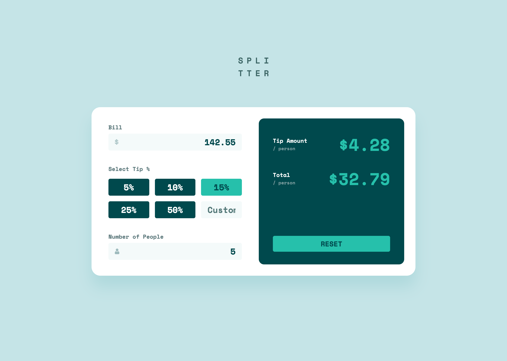
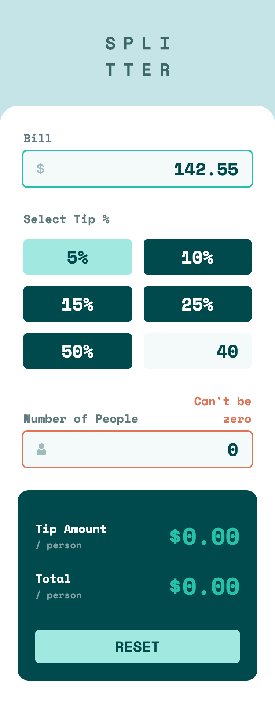
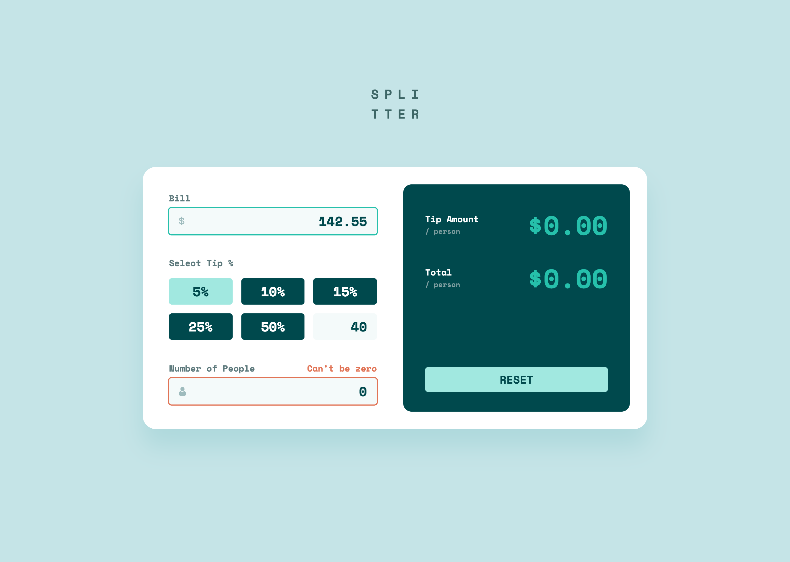

# Frontend Mentor - Tip calculator app solution

This is a solution to the [Tip calculator app challenge on Frontend Mentor](https://www.frontendmentor.io/challenges/tip-calculator-app-ugJNGbJUX). Frontend Mentor challenges help you improve your coding skills by building realistic projects.

## Table of contents

- [Overview](#overview)
  - [The challenge](#the-challenge)
  - [Screenshot](#screenshot)
  - [Links](#links)
- [My process](#my-process)
  - [Built with](#built-with)
  - [What I learned](#what-i-learned)
  - [Continued development](#continued-development)
  - [Useful resources](#useful-resources)
- [Author](#author)

## Overview

### The challenge

Users should be able to:

- View the optimal layout for the app depending on their device's screen size
- See hover states for all interactive elements on the page
- Calculate the correct tip and total cost of the bill per person

### Screenshot

|               Mobile designed at 375px:                |               Desktop designed at 1440px:               |
| :----------------------------------------------------: | :-----------------------------------------------------: |
|      |      |
|                Mobile (active states):                 |                Desktop (active states):                 |
|  |  |

### Links

- Solution URL: [https://github.com/elisilk/tip-calculator-app](https://github.com/elisilk/tip-calculator-app)
- Live Site URL: [https://elisilk.github.io/tip-calculator-app/](https://elisilk.github.io/tip-calculator-app/)

## My process

### Built with

- Semantic HTML5 markup
- CSS custom properties
- Flexbox
- CSS Grid
- Mobile-first workflow
- Fluid typography and spacing

### What I learned

- [Refactoring your code](https://www.frontendmentor.io/learning-paths/javascript-fundamentals-oR7g6-mTZ-/steps/66d097b43c19191dc323ec1d/article/read)
- [5 Tips to Write Better Conditionals in JavaScript](https://www.digitalocean.com/community/posts/5-tips-to-write-better-conditionals-in-javascript)
- [The Art of Code Refactoring in JavaScript: Techniques for Improving Code Quality](https://medium.com/@london.lingo.01/the-art-of-code-refactoring-in-javascript-techniques-for-improving-code-quality-edbfd119584a)
- [Semantic usage of the <label> in the form with radios](https://stackoverflow.com/questions/57616361/semantic-usage-of-the-label-in-the-form-with-radios)
- [how to create a custom Input radio button which have attributes inside it](https://stackoverflow.com/questions/72746367/how-to-create-a-custom-input-radio-button-which-have-attributes-inside-it) - The basic technique I followed for turning the standard radio button into something that is mainly just a clickable label (in a box). And another example of a [Radio button without the dot](https://codepen.io/jacobberglund/pen/mdPEza).
- Other resources for styling radio buttons - [Pure CSS Custom Styled Radio Buttons](https://moderncss.dev/pure-css-custom-styled-radio-buttons/) and [3 ways to style radio buttons with modern CSS](https://bryntum.com/blog/3-ways-to-style-radio-buttons-with-modern-css/) and [Styling Radio Buttons with CSS (59 Custom Examples)](https://www.sliderrevolution.com/resources/styling-radio-buttons/)
- [Radio buttons styling/design](https://design-system.service.gov.uk/components/radios/) - This is cool. A whole [government-wide design system](https://design-system.service.gov.uk/)!
- [HTML Forms: Radio buttons with text fields](https://stackoverflow.com/questions/12888612/html-forms-radio-buttons-with-text-fields) - The basic technique I followed to add the custom tip percentage box, as one option in the radio buttons group.
- [Styling fieldset elements with CSS](https://www.456bereastreet.com/lab/styling-form-controls-revisited/fieldset/) - Styling the fieldsets (and the legend) were a challenge for me, and I still don't feel comfortable with it. But here were some examples to wrap my mind around the general approach and what's possible.
- [Styling web forms](https://developer.mozilla.org/en-US/docs/Learn/Forms/Styling_web_forms) - And the follow-up [Advanced form styling](https://developer.mozilla.org/en-US/docs/Learn/Forms/Advanced_form_styling) that includes radio buttons.
- [Client-side form validation](https://developer.mozilla.org/en-US/docs/Learn/Forms/Form_validation)
- [Fetching data from the server](https://developer.mozilla.org/en-US/docs/Learn/JavaScript/Client-side_web_APIs/Fetching_data) - And the associated [Can Store example](https://github.com/mdn/learning-area/tree/main/javascript/apis/fetching-data/can-store).
- [HTMLFormElement: requestSubmit() method](https://developer.mozilla.org/en-US/docs/Web/API/HTMLFormElement/requestSubmit) - Acts as if a submit button were clicked. Gotten from [this StackOverflow post](https://stackoverflow.com/questions/35154348/trigger-form-submission-with-javascript).
- [How to convert a string to an integer in JavaScript?](https://stackoverflow.com/questions/1133770/how-to-convert-a-string-to-an-integer-in-javascript) - The [function `Number(value)`](https://developer.mozilla.org/en-US/docs/Web/JavaScript/Reference/Global_Objects/Number) is super useful.
- [How to format numbers as currency strings](https://stackoverflow.com/questions/149055/how-to-format-numbers-as-currency-strings) - Converting currencies using [`Intl.NumberFormat`](https://developer.mozilla.org/en-US/docs/Web/JavaScript/Reference/Global_Objects/Intl/NumberFormat).
- [CSS Selectors](https://developer.mozilla.org/en-US/docs/Web/CSS/CSS_selectors)
- [Using container size and style queries](https://developer.mozilla.org/en-US/docs/Web/CSS/CSS_containment/Container_size_and_style_queries) - Including [this CSS Tricks guide](https://css-tricks.com/css-container-queries/) and all of [Ahmad Shadeed’s Container Queries Lab](https://lab.ishadeed.com/container-queries/). This guy [Ahmad Shadeed](https://ishadeed.com/about/timeline/) seems pretty cool and worth following.
- [Link Pseudo-Classes (In Order)](https://css-tricks.com/snippets/css/link-pseudo-classes-in-order/)
- [Inspect webkit-input-placeholder with developer tools](https://stackoverflow.com/questions/26852922/inspect-webkit-input-placeholder-with-developer-tools) - The trick is to enable 'Show user agent shadow DOM' in the Settings panel of Chrome Developer Tools.

### Continued development

Hmm 🤔 ...

Specific areas that the solution should be improved:

- JavaScript code refactoring - Ugh! I feel like I didn't really [hit the mark on this one](https://www.frontendmentor.io/learning-paths/javascript-fundamentals-oR7g6-mTZ-/steps/66d097b43c19191dc323ec1d/article/read). Especially keeping my code DRY (Do Not Repeat Yourself), using objects to simplify logic, and favouring pure functions. There's more to do on this front, for sure.
- Vertical centering of the main container at the larger viewport widths, but with a smaller viewport height.
- Make sure the "Custom" label is entirely visible.
- Make sure the results labels and inputs are visible even for small viewport/container widths. Possibly move them to a vertical stack at smaller container widths. A similar challenge arises for the error messages, which should probably also be stacked vertically underneath the input labels (or possibly even underneath the input fields) at smaller container widths.

More general ideas I want to consider:

- [A (more) Modern CSS Reset](https://piccalil.li/blog/a-more-modern-css-reset/)
- [ARIA Authoring Practices Guide](https://www.w3.org/WAI/ARIA/apg/) - Incorporate all of the [https://www.w3.org/WAI/ARIA/apg/patterns/](patterns) and [practices](https://www.w3.org/WAI/ARIA/apg/practices/) associated with ARIA. Such as the [radio buttons pattern](https://www.w3.org/WAI/ARIA/apg/patterns/radio/) and the [Radio Group Example Using Roving tabindex](https://www.w3.org/WAI/ARIA/apg/patterns/radio/examples/radio/)

### Useful resources

- [MDN Web Docs for CSS](https://developer.mozilla.org/en-US/docs/Web/CSS) - Went here a lot to reference the different CSS properties and the shorthands, and all the great explanations about best practices.
- [MDN Guides](https://developer.mozilla.org/en-US/docs/Learn) - So many resources and nice explanations, including stuff [tutorials specific to Javascript](https://developer.mozilla.org/en-US/docs/Web/JavaScript/Guide).
- [Every Layout](https://every-layout.dev/) - My go to source for thinking about layouts now.
- [The Clamp Calculator](https://royalfig.github.io/fluid-typography-calculator/) - Used for all of fluid typography and fluid spacing calculations.

## Author

- Website - [Eli Silk](https://github.com/elisilk)
- Frontend Mentor - [@elisilk](https://www.frontendmentor.io/profile/elisilk)
